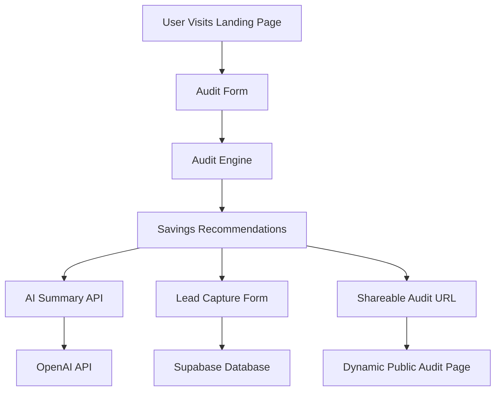

# Architecture

## System Diagram

---

## Data Flow

1. A visitor lands on the homepage and submits AI tooling information.
2. The audit engine evaluates overspending opportunities using deterministic pricing rules.
3. Savings calculations and optimization recommendations are generated.
4. A personalized AI-generated summary is requested through the OpenAI API.
5. Users can optionally save their audit report through the lead capture form.
6. Lead and audit data are stored in Supabase PostgreSQL.
7. A public shareable audit URL is generated dynamically.
8. Dynamic metadata generates optimized Open Graph previews for social sharing.

---

## Stack Decisions

### Next.js

Chosen because it provides:
- Full-stack architecture
- Dynamic routing
- API routes
- Metadata generation
- Vercel deployment integration
- Excellent developer experience

### TypeScript

TypeScript improves:
- maintainability
- pricing calculation safety
- autocomplete support
- refactoring confidence

### Tailwind CSS

Tailwind enabled rapid UI development while maintaining consistency and responsiveness.

### Supabase

Supabase was selected because it:
- provides PostgreSQL immediately
- simplifies backend development
- supports scalable APIs
- integrates well with Next.js

### OpenAI API

OpenAI is used only for personalized summaries.

Financial calculations themselves intentionally avoid AI to ensure deterministic and financially defensible recommendations.

---

## Scaling Considerations

If scaled to 10k+ audits/day:

- Add Redis caching layer
- Queue AI summary generation asynchronously
- Add database indexing
- Implement edge caching for public reports
- Add API rate limiting
- Move analytics into event pipelines
- Add background processing workers

---

## Security Considerations

- Secrets stored in environment variables
- No API keys exposed client-side
- Public audit URLs exclude personally identifiable information
- Database writes occur through controlled API routes
- Form persistence stored locally only

---

## Future Improvements

- Multi-tool audits in a single session
- Benchmarking against startup averages
- PDF report export
- Admin analytics dashboard
- Referral system
- Team collaboration support