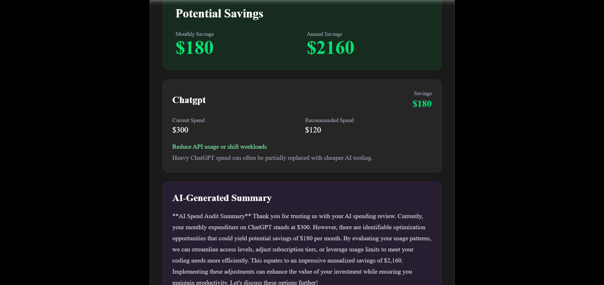
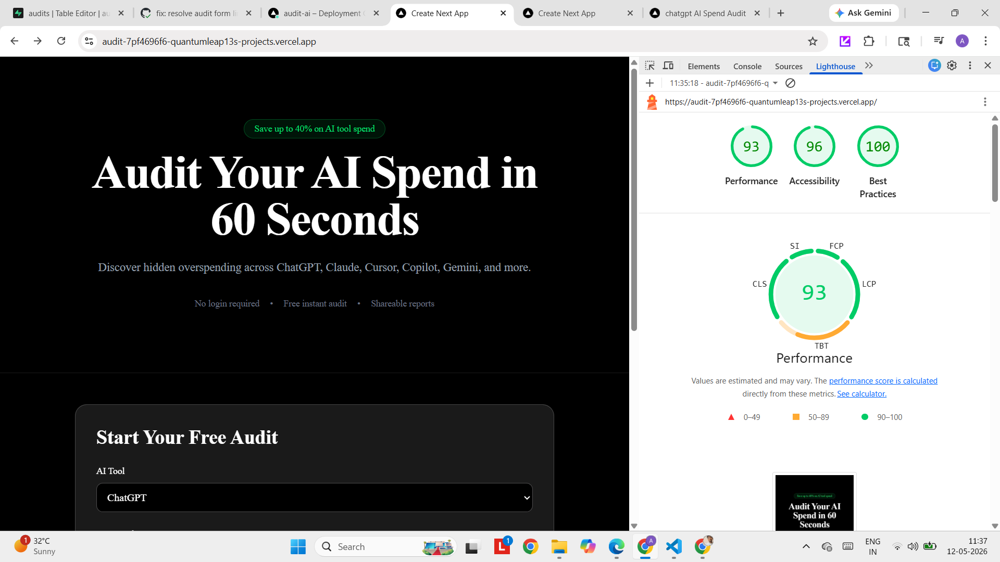

# Audit AI

Audit AI is a free AI spend optimization platform that helps startups identify unnecessary AI tooling costs across ChatGPT, Claude, Cursor, GitHub Copilot, Gemini, and related products.

The platform generates instant cost-saving audits, personalized AI summaries, and shareable public reports while capturing high-intent leads for infrastructure optimization services.

## Features

- AI spend audit engine
- Personalized AI-generated summaries
- Shareable audit URLs
- Lead capture with Supabase
- OpenAI integration
- Real-time savings calculations
- Persistent form state
- CI/CD with GitHub Actions
- Responsive modern UI

## Tech Stack

- Next.js 15
- TypeScript
- Tailwind CSS
- Supabase
- OpenAI API
- Vercel
- Vitest

## Screenshots

## Screenshots

### Landing Page


---

### Audit Form


---

### Audit Results



---

### Lighthouse Performance



---

## Demo Video

[Watch Demo Video](./public/screenshots/a5.mp4)

## Quick Start

```bash
npm install
npm run dev

```

Open:

http://localhost:3000

## Environment Variables

Create a `.env.local` file:

```env
NEXT_PUBLIC_SUPABASE_URL=your_supabase_url_here
NEXT_PUBLIC_SUPABASE_ANON_KEY=your_supabase_anon_key_here
OPENAI_API_KEY=your_openai_api_key_here

## Decisions

### 1. Hardcoded audit rules instead of AI pricing analysis

The assignment emphasized financially defensible logic. Deterministic rules produce more reliable recommendations than fully AI-generated pricing decisions.

### 2. Next.js App Router

Chosen for:
- server-side rendering
- API routes
- dynamic metadata
- scalable routing
- deployment simplicity

### 3. Supabase instead of custom backend

Supabase accelerated backend implementation while still providing production-grade PostgreSQL infrastructure.

### 4. Minimal onboarding friction

The audit is generated before lead capture to maximize trust and conversion rates.

### 5. Shareable public reports

Public audit URLs create a built-in viral growth loop and improve organic distribution.

## Deployment

Live URL:

https://audit-ai-alpha.vercel.app

## CI/CD

GitHub Actions automatically runs:
- linting
- automated tests

on every push to `main`.

## Testing

Run tests locally:

```bash
npm run test
```

## Future Improvements

- Multi-tool audits in one report
- Benchmarking against industry averages
- PDF export
- Team collaboration dashboards
- Referral system